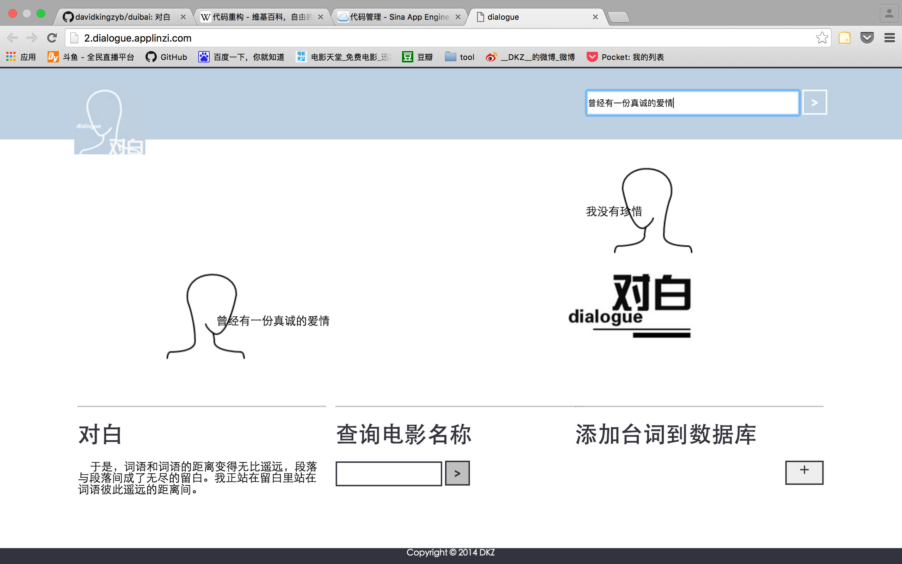
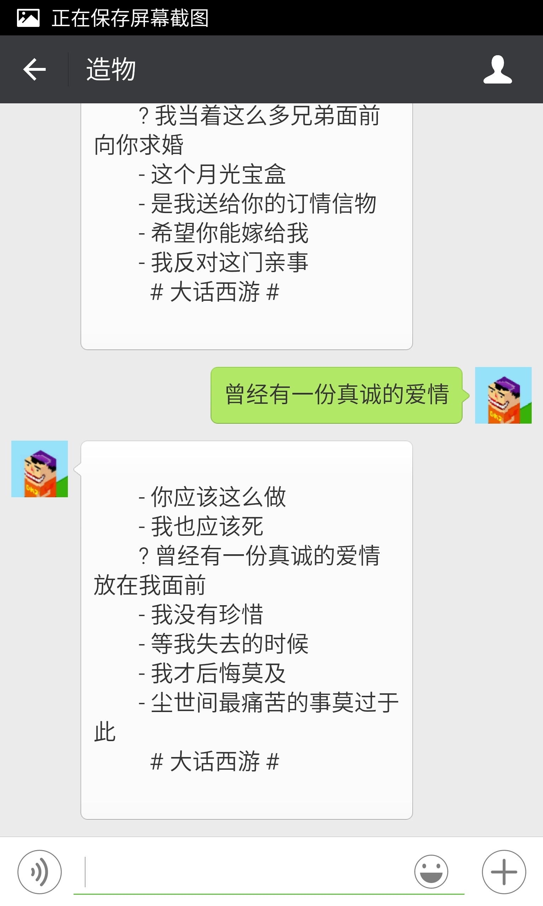

#重构

**重构 对白**

2016/1/30 by DKZ

重构，指的是在程序开发过程中不改变外部行为单就程序内部作出的修改。大概意思就是重做一遍，东西还是相同的东西，功能也没有什么大的变化，样子也和之前差不多。我最近重构了[对白](http://dialogue.sinaapp.com/)这个项目。讨论这样做的意义比重构这件事情本身更没有意义。我就直接说对白这个项目吧。

严格意义上讲**对白**是我的第一个比较完整的项目。一个查询电影对白的网站，用户可以自己上传电影字幕文件。基于这些字幕文件，提供对白关键字的查询。做第一个版本的时候刚学python，射手网也还在，做这个仅仅是因为爱好，妄想达到一种和我说一句话我用一句电影对白来回答你的人工智能效果。到当前这个版本的时候编程成为了饭碗，射手网（伪）还在，不知道重构它有什么意义，还是那些功能，人工智能并没有出现，只能回你一句不知所云的对白。

对白经历了三次比较大的重构。起先是看了一本<head first python>的书作为我的python启蒙照猫画虎写了对白的原型。用的是python内置的CGI拼接字符串来响应请求，自己写了个srt字幕文件的解析器，把字幕文件导入到sqlite中去。

第二次重构是为了把项目放到sae上去，用了django框架，数据库改用mysql。样子变成了上面这种[复古的形态](http://2.dialogue.sinaapp.com/)，加了些ajax的功能。还尝试分词，优化搜索。但是这些优化并没有起到实际的效果，我没办法找到最合适的那句话，也不能把所有的答案都呈现出来。我想仅靠我自己上传的那些电影字幕无法获得足够大的数据库支持这些算法，数据出口太窄也应该背锅。但说到底就算你坐在我面前问我本人，我也很难用唯一的答案回答你，人工智能什么的不更是扯淡呢吗？

第三次，这一次重构，主要是简化，用flask代替django，删去了不必要的功能，换了个样子，虽然复古的看起来还不错，但是想到我要重写这部份样式，我不得不放弃了它，或许等我下次有空再考虑重构这部分吧。srt的文件解析使用了pysrt这个库，有一些乱码的问题有待解决。增加了一个微信的接口，可以关注我的微信号**造物**尝试这个功能。第三版的源码放在[github](https://github.com/davidkingzyb/duibai)上对这个项目有兴趣或者需要参考可以前往。

我上传了几部有经典对白的电影字幕

* 《大话西游》“曾经有一份真诚的爱情放在我面前”

* 《她》这部讲人工智能的，就是这个项目妄想达到的状态 “段落与段落间成了无尽的留白”

* 《一代宗师》“念念不忘必有回响”

* 《重庆森林》王家卫有两部，逼格甚高

* 《七个神经病》

上传字幕文件解析的编码有些问题，暂不欢迎大家上传。喜欢的朋友可以关注一波**造物**，不喜欢请点举报。

