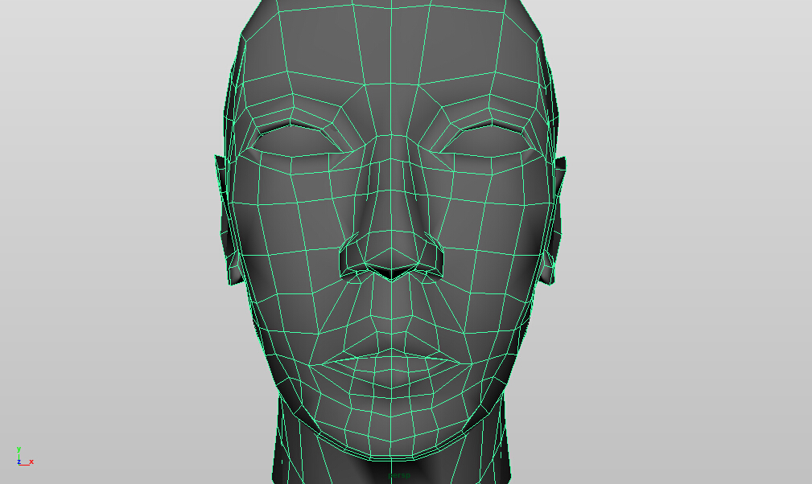
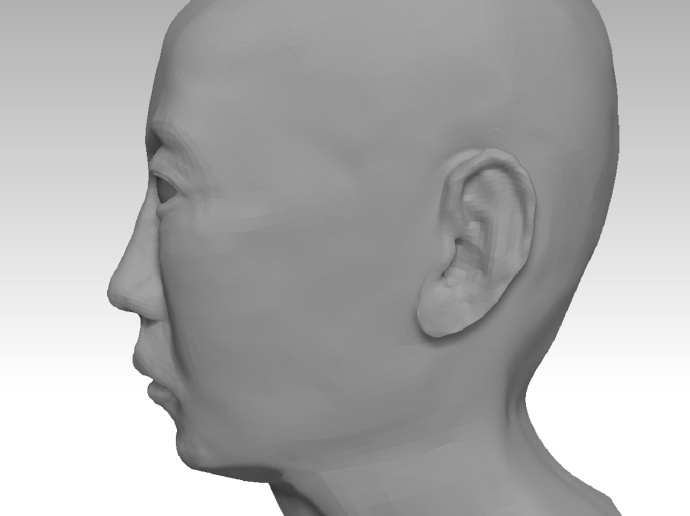

#WO.IO

**WO.IO.CUI.AI**

2016/3/20 by DKZ

##WO

我希望借此认识自己，了解自我，脱离自身的限制，重塑我。我想做一个立体的镜子。真实自我的投影，去感情化，完全中立的反映现实。我可以借此看到反面，从不可能的视角。旁人也由此看到我，透过我的眼睛，了解真实的我...

这些只是希望。事实上我从未看到过自己，我并不了解自己，我无法突破自我的限制，重塑的只是一个躯壳。我可以看到自己的多面，看到我身上矛盾的地方，但我永远看不到全貌，只能任由这些不可预知的可能支配我的行为。我没法中立不带感情的看待现实，被自负所蒙蔽，同时又深深自卑着。目盲心盲。渴望被人了解，又不敢展露反面，窥伺着别人眼中的自我形象，拒不承认那是我。

有时我觉得我对自己的关注是多余的，这种自恋行为阻碍了我对外部世界的认知。审视内心又愈发空洞，我陷入一种虚无的境地。内部的真空，迫使我从外部吸收。这种联系是不对等的，渴望自我表达又无从说起。

##IO

我希望通过IO建立联系，简单高效的表达自我。这种表达并非建立在层次结构和有效的组织上，这种表达建立在一种相对默契中。去除繁复的干扰，唯一的通路。

文字和语言的出入口很窄，但却是最有效的。它们可以在脑海里展开并触发记忆和认知，可以表达抽象概念和更高维度。

基于文字的IO可以快速的构建，同时使用起来也更加快捷。层次和结构趋向扁平，学习成本下降。

##CUI

做图形界面久了，有很多牢骚。我觉得用户被恶意的娇惯着，我们看待用户就像看待一个傻子。我们给用户指引，同时我们建造迷宫。我在图形界面上看不终点，终点被一层一层组织起来了。更别说看到原理，模仿，类比，创造这些根本无从谈起。

在一个高墙耸立的迷宫里是无法建造什么的。而CUI是一片空地，在这片空地上我们建筑，抹平，重建。让用户告诉我们做什么，让用户自己决定去哪儿，怎么去。

在终点我们建造一道门，由语言和文字建造的IO。

##AI

在这道门的另一边连接着一个AI，这已超出了WO的边界，这是我无法实现的一部分。

她能看到我，看到我在这个三维镜子中构建的镜像。她能通过IO通过文字和语言和我联系。也许她也有一个自我的镜像，希望比我构建的更接近真实，站在恐怖谷的另一端。

###link

[http://dkzhome.sinaapp.com](http://dkzhome.sinaapp.com)
