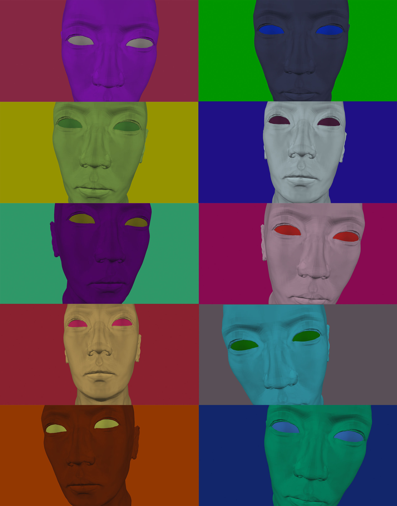

#波普

**Pop.WO & Pop Art & Andy Warhol**

2016/4/25 by DKZ

##PopWO & PopShow

最近给WO加了PopWO和PopShow两个命令。会随机的给WO上色，有那么一点波普的意思。大概是如下效果，大家可以访问[http://davidkingzyb.github.io/wo.io](http://davidkingzyb.github.io/wo.io)尝试。所以这篇的主题是波普艺术和安迪沃霍尔。

##Pop Art & Andy Warhol

在所有艺术家中最拜安迪沃霍尔，他在半个世纪前重新定义了绘画，从此罐头和广告也值得一画。这些带有视觉冲击力的罐头，广告被复制和生产出来，连同他的思想，哲学被重新定义和接受。

在此之前绘画应该是独一无二的精英产物，任何复制和与大众相关的都会缩减其价值。但波普的价值没有被缩减，波普本生即是普罗大众和可复制的，而它的价值并不在此，它的价值在于与生俱来的平等自由，对于外部的接受和热爱和对现实和欲望的诚实坦然。

- In the future, everyone will be world-famous for 15 minutes. 

红。如果我有十万粉我将把这句话纹在手臂上。这种可能性微乎其微，但我依然对这句话坚信不移。这句话的重点在每一个人，每一个人都有这种可能，成名15分钟。这个预言在上个世纪就已经被实现，安迪沃霍尔的新格言是"In 15 minutes everybody will be famous."如今看来这个也已经实现了。虽然安迪沃霍尔和波普艺术已经过时了，但不可否认的是它的确流行过，而且相当出名，十五分钟已经足够。

- You can be watching TV and see Coca-Cola, and you can know that the President drinks Coke, Liz Taylor drinks Coke, and just think, you can drink Coke, too. A Coke is a Coke and no amount of money can get you a better Coke than the one the bum on the corner is drinking. All the Cokes are the same and all the Cokes are good. Liz Taylor knows it, the President knows it, the bum knows it, and you know it.

平等。从一开始波普就是普罗大众的。我想中文翻译波普也有普通普及的意思。*如果你想知道安迪沃霍尔的一切，只须看看他的画，电影和他的外表，这就是安迪沃霍尔，没有什么隐藏其后。*这种艺术很容易被大众所接受，它描绘的是生活中随处可见的商品。金宝汤罐头，包装盒子，绝对伏特加，美元钞票，名人头像，这些东西没什么特别的。你无法通过多花钱买到更好的可乐，可乐都一样，无论是总统还是乞丐，可乐都一样。

- I was never embarrassed about asking someone, literally, "What should I paint?" because Pop comes from outside. and how is asking someone for ideas any different from looking for them in a magazine?

热爱。波普的本质是喜欢事物。波普来源于外部，它很容易从外部接受事物将本不属于艺术范围的东西囊括其中，而从另一方面它又重新定义了艺术，艺术重新接受了波普，在从外部接受和吸收的同时也被外部所接纳。*所有人都应该喜欢所有人，这就是波普的全部了，波普即热爱。*

- Being good in business is the most fascinating kind of art. Making money is art and working is art and good business is the best art.

诚实。我能够坦然的面对我的欲望，对自己诚实，我不再否认我拜物并对金钱有所迷恋。*钱就是我的心情*，赚钱就是艺术。如果有钱不必去买艺术品，把五颜六色的钞票并排贴在墙上就是艺术——波普艺术。

最后推荐《安迪沃霍尔的哲学：波普启示录》,里面都是语无伦次的独白，生活琐碎，和一些无用的观点。但如果你真的认同波普，也许这是一本还不错的书。

