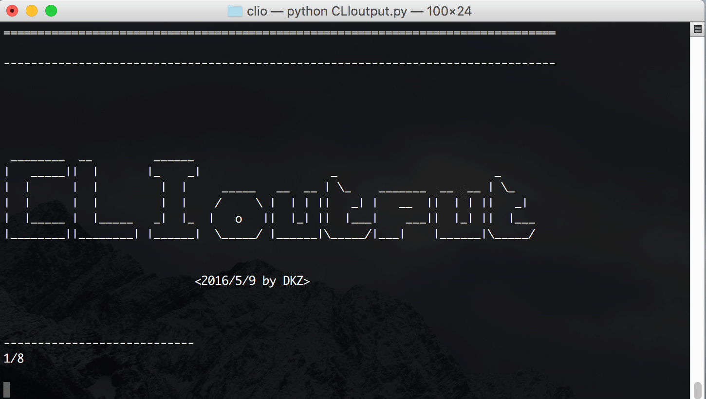

#CLIoutput

**Command Line Interface Output 两分钟制作装逼PPT**

2016/5/9 by DKZ

老大：“哎，把老板演讲用的PPT给我。”

我：“！？”（好像周五的时候老板提过这么一会事，不是让我做吧？周末陪妈妈过节谁还记得这事儿呢。。。）

老大：“快点哦，老板5分钟后上台讲呢。”

我：“哦！”（卧槽这可咋办呢？）

别着急，使用[CLIoutput](https://github.com/davidkingzyb/CLIoutput)两分钟制作一个基于命令行的PPT。

1. 先把这个clio-pptinit.py摁一哈，输入title和页数
2. clio-pptinit.py会自动生成一个ppt脚本，记事本打开添加点内容（具体参看CLIoutput.py例子）
3. 撒还要图表？CLIoutput自带了几种图表，一行代码搞定。
4. 两分钟到了！没办法了点一哈这个ppt脚本吧

是不是复古科技感十足呢？（两分钟就别要求太高了嗷）

点一哈回车就下一页了，具体使用方法到[https://github.com/davidkingzyb/CLIoutput](https://github.com/davidkingzyb/CLIoutput)上看吧。这个项目本身是用作命令行输出的，可以让乱七八糟的东西在命令行下变的更有序，用作python命令行调试或者文档编写都是不错的选择呢。可能刚开始上手有点难，两分钟我说说而已的，但熟悉了之后命令行绝对是最高效的选择哦。

老板：“小伙子，ppt做的不错哦！”

我：“谢谢老板”

老板：“看你懂点技术的，以后办公室的电脑坏了就交给你修了哦。”

我：“哦。。。”

觉得有用的话。可以关注下我的微信公众号，时不时会推送一些没用的东西。