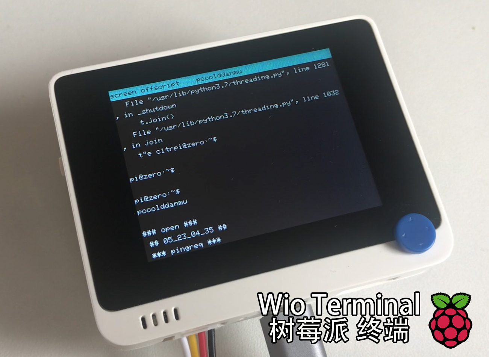

# Wio Terminal

**Wio Terminal 树莓派终端**

2020/5/23 by DKZ

最近使用 Wio Terminal 做了一个树莓派的终端，使用将树莓派命令行的标准输出到 ttyS0 再用串口和 Wio Terminal 通信。做了一些功能。

- 遥感控制的键盘
- I2C小键盘
- 菜单选择
- 开关显示屏
- Wi-Fi AP（暂无用）
- 脚本命令菜单
- terminal交互，显示，翻页
- 记录之前命令

还有些计划中的功能，usb host，sd 卡等等。等之后有空再写吧，项目暂未开源，等完善一些再说吧。

又是一个无用的项目，帮我杀了很多时间。这两年做了好多这样无意义的事啊，确实有些迷茫，学些新东西，动动手让自己充实一点罢了。可以说从毕业以来一直都有迷茫的感觉，只是前些年这种感觉被年轻和无畏的举动掩盖了。

现在我感觉我身上不再有棱角，但也不是所谓的圆滑，只是柔软。我感到迷茫，我用力汲取周围的一切，努力让自己变得充实，但这都不足以填满我的空虚，使我变得坚硬。

我知道再随波逐流我会溺死在水中，但我真的不知道选哪边。做河的第三条岸啊，做这世界上最坚固的岛屿，最后再成为大陆的一部分。
