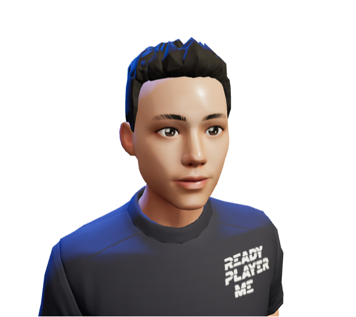

# VRChat

**VRChat研究**

2022/10/27 by DKZ

## 介绍

VRChat 是一个由**用户提供内容**的**多人在线** VR 游戏。  
玩家可以在其中访问开发者提供的 **World** 场景，在在场景中互动，和其他玩家聊天，选择个性化的 **Avatar** 角色展示。  
开发者可以搭建自己的 World 场景，设置互动内容，分享到社区邀请玩家访问，或制作 Avatar 提供给玩家。  

只支持 Unity 引擎开发（v2019.4.31f1），渲染使用 Build-in Render Pipeline(legacy) 默认管线。  
提供 **VRCSDK3**（World）和 **Avatar3.0** SDK 给开发者使用。

因为 VRChat 游戏内容是用户提供的，所以需要一套沙箱机制，限制开发者可以访问的组件和系统功能，以保证安全性。  
禁用了部分 Unity 组件（参考[组件白名单](https://docs.vrchat.com/docs/whitelisted-world-components)）。并提供 **Udon** 让开发者实现简单的游戏功能。

## World 

### Prefab

提供一些方便的预制件快速构建world

- VRCWorld 基本组件拖入场景就可以
- VRCPortal 通过roomid链接其他world
- Video Player 一起看视频
- Pen 画画
- ...

### Player API

提供了一些 Udon 节点处理线上玩家交互

- getPlayers
- postion,speed
- Collisions
- Voice
- Avatar

### Network

联网处理多个client世界同步

- VRC Object Sync 组件同步 GameObject transform
- Variable blogImg/synced 属性同步值
- SendCustomNetworkEvent 发送事件给所有玩家

例子：pickup

### Udon Node Graph

类似蓝图的编程方式，实现自定义的脚本，节点分了如下的几类

- Debug 日志
- Events 事件
- Special 编程相关 循环 值
- System 系统 时间 基本数据类型 (有限的调用系统功能)
- Type 类型 
- UdonBehaviour 事件广播 状态设置
- UnityEngine Unity组件
- VRC VRChat组件 

## Avator

1.利用支持VRChat的捏脸软件 [Avatar Creator Systems](https://hello.vrchat.com/avatar-systems) 创作卡通、emoji风格的 Avatar。
2.第三方角色创造软件[VRoid](https://vroid.com/en/studio)。
3.专业建模软件。

1.需要一个绑定骨骼的模型导入unity。
2.unity里面绑定animator组件对应骨骼名称，绑定动画。
3.拖入vrc avatar组件并设定摄像机位置，并依次解决vrchat里的报错。

## 发布

[VRChat Community Labs](https://docs.vrchat.com/docs/vrchat-community-labs)  
发布你的 World 到社区，经过审核后会自动发布  

## Open Sound Control（OSC）

设备间传输数据，和其他人聊天。

### midi

支持额外的硬件设备

## Unity 编辑器扩展 & 插件开发

### 编辑器扩展

1.顶部编辑器菜单：引用using UnityEditor; 使用MenuItem;  
2.Inspector面板的处理：继承Editor，重写虚方法：OnInspectorGUI，并调用(父类的此方法)base.OnInspectorGUI  
3.窗口的面板：继承：EditorWindow, 使用EditorWindow.GetWindow; 调用窗口的Show方法。 

GUI  
GUILayout(带自动布局)  
EditorGUI(只能在编辑器使用)  
EditorGUILayout

### Managed plug-ins 

可使用 C# .NET框架打包dll使用，vrchat可能是这种方式。

### Native plug-ins

可以调用系统原生的库中的函数，要针对操作系统分开构建。

### Visual Script

把大象放进冰箱一共分三步

1.Unity对象映射到节点对象（反射获取成员自动生成）
2.用这些节点构建一个图形化的编辑脚本系统（编辑器，节点逻辑，Debug）
3.图形脚本映射回脚本语言执行

[Constellation](https://github.com/ConstellationLanguage/Constellation)

### 结论

#### Visual Script 优缺点？

##### 优点
1.门槛低 设计师友好
2.现代引擎趋势 大型游戏工业化分工细化后 为关卡设计师提供工具
3.优例 Shader Graph 
    - 发展成熟 线性渲染管道合适
    - 步骤可视化
    - 功能有限，几百个节点即可满足

##### 缺点
1.逻辑复杂 抽象时就是一堆乱麻
2.维护成本高
3.协同不方便 merge可读性 用不了git这种
4.学习成本 文档变成视频
5.制作成本 做不好就是飞行仪表盘
6.debug

#### Recroom vs VRChat 模式？

VRChat提供了高的灵活度而大多用户没有能力使用。
类似的VR内编辑器也提供了很大的灵活度，但其实用户并不需要一颗飞在天空中的树，即使是专业的游戏开发也有辅助自动生成。
应该包装限制灵活度，类似建造游戏（Townscaper）或者类似的方式可以扩大受众。

## Reference

[docs](https://docs.vrchat.com/docs/current-unity-version)  
[home](https://vrchat.com/home)  
[udon video](https://www.youtube.com/watch?v=dpolR6NjNhw&list=PLKZq_8GX6ausR6zMMODRsZpaewrLKXWbV&index=14)  
[avator video](https://www.youtube.com/watch?v=E-g2oSPrVLQ&list=PLKZq_8GX6ausR6zMMODRsZpaewrLKXWbV&index=15)  
[example video](https://docs.vrchat.com/docs/obstacle-course)  
[unity UI](https://docs.unity3d.com/cn/current/Manual/UIToolkits.html)
[unity plugins](https://docs.unity3d.com/cn/current/Manual/Plugins.html)
[Games104](https://www.bilibili.com/video/BV1oU4y1R7Km)
