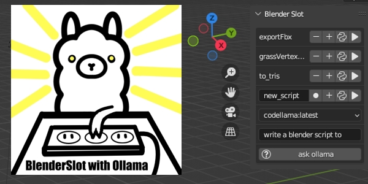

# Blender Slot

**A blender addon for record your operations, manage your customize scripts and generate script by AI with Ollama.**

2024/4/9 by DKZ

1. name your script  
2. press record button and do your operations   
3. press stop button and edit scripts  
4. press execute button  
5. press add button can save script to BlenderSlot  

## v1.1 Generate scripts use AI

Install [Ollama](https://ollama.com/), and now we can use AI to generate script in BlenderSlot!

***

Find more scripts at [issues page](https://github.com/davidkingzyb/BlenderSlot/issues),Welcome to share your scripts.

