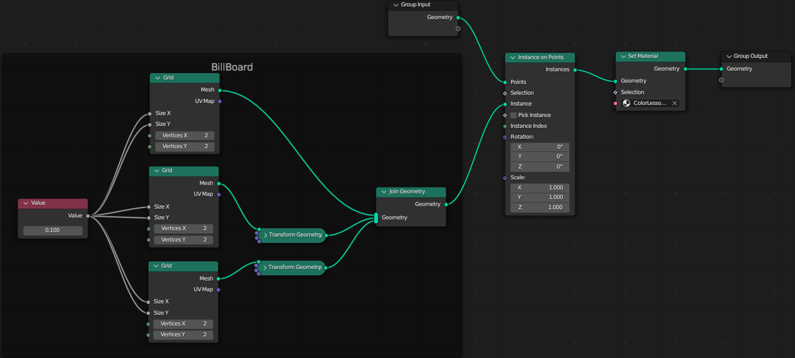

# Color Lesson

**研究色彩在HSV空间中分布规律的可视化工具**

2024/1/8 by DKZ


这是一个用于研究颜色在 HSV 空间分布的可视化工具，可以将一张图片每个像素的颜色提取出来映射在 HSV 色彩空间中。

[点这里](https://davidkingzyb.github.io/template/ColorLesson.htm)可以尝试这个软件。里面内置了一些取色器，采样，色板等小功能可以用作板绘时的参考。

用法是

1.选择文件  
2.load图片，可点击图片吸色  
3.设置色板大小，边框，是否下采样（使用高斯卷积），缩放比，偏移等参数  
4.点击采样可查看采样后的图片和生成的色板  
5.点击 color lesson 可生成一个 json 文件，包含 HSV 空间位置信息  

接下来可以用这个脚本将 json 导入到 blender 中

```
import bpy
import bmesh
import json

# 假设verts是一个包含点位置的列表
verts =[[1, 0, 0], [0, 1, 0], [0, 0, 1], [0, 0, 0]]
with open('C:/Users/DKZ/Desktop/color_lesson.json','r') as f:
    j=json.load(f)
    verts=j.get('d',[])
    
mesh = bpy.data.meshes.new(name="ColorLessonMesh")  # 创建一个新的mesh
obj = bpy.data.objects.new("ColorLessonObj", mesh)  # 创建一个新的object

scene = bpy.context.scene
scene.collection.objects.link(obj)

bm = bmesh.new()
for v in verts:
    bm.verts.new(v)  # 添加一个顶点

#bm.faces.new(bm.verts)  # 通过所有顶点创建一个面

bm.to_mesh(mesh)  # 将bmesh写入到mesh
bm.free()  # 清理bmesh

mat = bpy.data.materials["ColorLessonMaterial"]
if len(obj.data.materials):
    obj.data.materials[0] = mat
else:
    obj.data.materials.append(mat)
    
node = bpy.data.node_groups["GNColorLesson"]

if obj.modifiers.get('GeometryNodes'):
    obj.modifiers['GeometryNodes'].node_group = node
else:
    obj.modifiers.new('GeometryNodes', 'NODES')
    obj.modifiers['GeometryNodes'].node_group = node
```

使用这个几何节点，生成 HSV 空间的分布



由于位置信息在 HSV 圆柱体中就代表了颜色信息，所以只要用 xyz 直角坐标转化为极坐标得到的值就是 HSV 表示的颜色

所以直接只用 shader 把颜色渲染出来就可以看到最终这张图片的色彩分布情况了


最后效果如下  


接下来会找一些艺术家的画研究一下他们所使用的颜色


