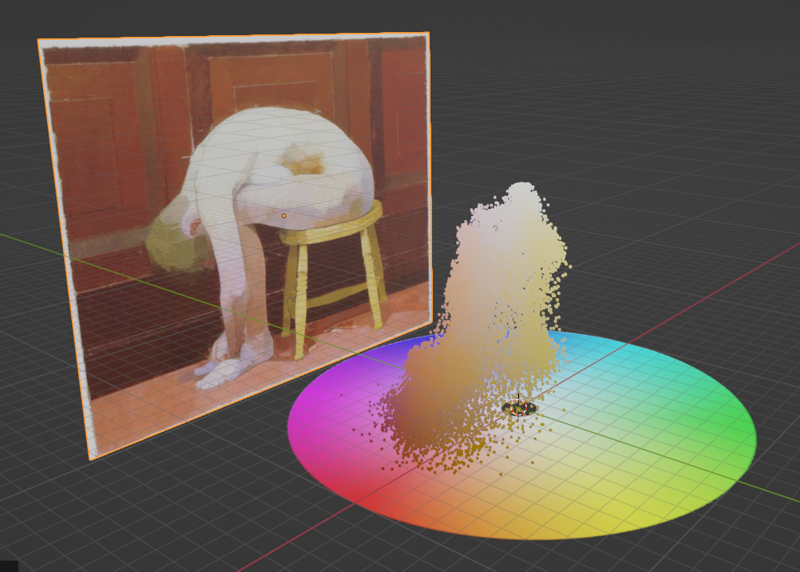
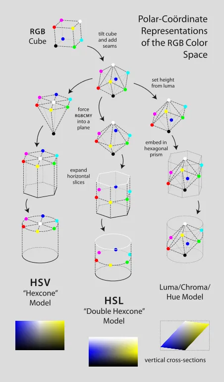

# Color Lesson 2  

**研究绘画作评色彩在HSV空间中分布规律**

2024/1/20 by DKZ

<iframe src="//player.bilibili.com/player.html?aid=454061317&bvid=BV1D5411C7Lq&cid=1413338797&p=1" scrolling="no" border="0" frameborder="no" framespacing="0" allowfullscreen="true"> </iframe>

使用[Color Lesson](https://davidkingzyb.github.io/template/ColorLesson.htm)这个工具，对文艺复兴以来的西方绘画作品的色彩在HSV空间中的分布进行了一些分析，选取了巴洛克，洛可可，古典主义，浪漫主义，以及印象派，后印象派，纳比派，点彩派，野兽派，风格派，表现主义，波普艺术等艺术流派的代表作品进行展示。

开始之前还是提一下色彩空间HSV定义，是在极坐标系中表示颜色的方法，可用角度表示色相（Hue），半径表示饱和度（Saturation），高度表示明度（Value）。可以把这个空间想象成由笛卡尔坐标系几何结构的RGB模型变换而来的一个圆柱体，顶面的圆越向中心越白，越边缘颜色越纯，越向下越黑。HSV相较于RGB颜色表示更加直观，符合人们对色彩的认识，广泛用于计算机图形，板绘等需要选取颜色的场合。

这里选取的绘画素材均来自[google arts and culture](https://artsandculture.google.com/)，这个网站。在每幅画上平均采样512*512个点，绘制在HSV空间中。

从色相分布来看，黄蓝这条线上分布的颜色较多，尤其是高饱和度的颜色。紫色分布最少，绿色的使用明度和饱和度都比较低分布像坡度较缓的山坡。颜色的集中度随时间而发散，文艺复兴至印象派前的作品多集中在相同色相的细微变化，可能与当时的颜料，工具工艺的限制，作品保存等因素都有关系。另一个影响较重的层面可能是绘画方式和理念的变化，印象派在室外写生的绘画方式将阴影处的蓝色带入了色域，社会结构和物质发展带来雇佣方式的改变也给了画家们在颜色使用上更大的自由。之后以表现派为代表的画家们脱离了现实和自然的束缚，绘画的对象和主体更为抽象注重内在表达，颜色运用也更为大胆，常用高饱和度的颜色给人们强烈的情感冲击。  

当然这个项目还是存在不少问题，一个是我所使用的图片和真实画作之间的色差，不管是因为光照，器材，拍摄手法，或者后期的调色，图片算法的压缩，甚至是这个工具里带的采样功能都可能会存在难以消除的色差，这些色差会导致最终颜色的空间分布产生一些偏移。第二个HSV这个色彩表示方法本身是为了方便人类理解而构造的空间，在HSV圆柱体中颜色的分布不是线性的，暗部和亮部的分布也不均匀，暗部被极大的压缩了，有机会的话可以尝试使用其他的色彩表示空间如HSL或HCL。另外现实世界颜色的分布形态也不可能是一个圆柱体，所以以上所有的展示都不是这些画的颜色在现实中的绝对形态。

所以这个项目得出结论仅仅用作参考，不过这个项目解决了一小部分我很小的时候一直困惑的问题，即我看到的蓝色和别人看到的蓝色是一个蓝色吗？即便蓝色只是给晴朗时天空的颜色一个模糊的代称，而我还是无法探究他人的精神世界。但起码我扩展了我的知觉，用一种科学的方式度量了我看到的世界和现实之间的距离。  

最终学习色彩理论还是离不开感性认识，希望这个项目能给你的创作带来一些帮助，可能是下次在调色板上吸色时能更笃定一些。工具的链接可以在视频下方找到，有需要的可以拿去使用。

