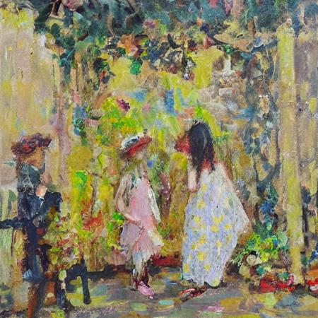

# 炼丹炼丹

**Stable Diffusion LoRA 训练心得**

2024/3/11 by DKZ

最近沉迷炼丹，用我爸爸的绘画作品训练了一个[LoRA](https://civitai.com/models/337209/zengxinstyle)。发现炼丹这个比喻真的很恰当，各种参数之间的关系类似玄学，训练本身则更像一个试错的过程。AI也是一样，在查了一堆资料之后似乎搞明白了扩散模型，以及图片训练和生成的过程，但真要问原理是啥我想我答不上来。可能AI研究本身就是探究人类的智能尝试复原人类的认知结构，而这个结构可能只是从混沌中演化出来的。所以不敢说真的悟出了什么道理，只是有些失败的教训给各位道友分享，希望各位少走弯路。 

使用的工具是[kohya_ss](https://github.com/bmaltais/kohya_ss)这个工具。 

打标是非常关键的一步使用 wd14 ，和我自己做的一个[手动打标插件](https://github.com/davidkingzyb/SimpleTaggerEditor)。另外数据集的选择非常关键，由于我爸爸的画作并非具象写实的那一派，很多画面的元素不能被很好的提取tag，而且在图片生成时提示词的作用也不是很明显。所以我尝试把同意题材的作品放入一个数据集中训练，这样在使用的时候，这个lora也能充当触发提示词的作用。另外训练数据集的大小也是一个相当关键的参数，直接影响到训练的步数效率和训练结果。

底模选择stable diffusion v1.5，因为大的底模需要显存更高，训练时间更久，一些混合模型或微调过的模型又可能没啥普适性。  

训练LoRA方式尝试了，iA3，loHa，loKr。iA3得出的LoRA很小，效果还行，而且需要调的参数很少，推荐入门可以尝试，但在comfyUI上使用出现了一些问题。loha和lokr可以自己选择参数，我的建议是从默认参数开始，根据需要调整。另外不要试图通过控制变量的方法穷举出最好的效果，这些参数之间存在一些微妙的联系，我愿称之为玄学，改变一定量有时可能会产生巨大反应，有时可能一点效果没有。  

最后我想说在绘画上，对于好的定义，本来就是模糊的。对应AI风格训练也应如此，loss最小不代表最好或者最像。有时这事要随缘，各位道友切莫强求，以免坏了道心。  

以下是参数部分，是个人经验，只针对曾新油画作品风格学习：

### 步长（steps）

`steps=(image_nums*repeat)*epochs/batch_size`

这个公式包含四个非常重要的参数，这四个参数会直接影响需要训练的步数，步数就是时间就是效率，也直接关系到学习的好坏。    
- image_nums：和数据集有关，不要太大超过100可以分成两个，我一般是60-80  
- repeat：可以高一点20-30，不能太低了  
- epochs：因为设置每隔n个轮次保存，所以可以用这个控制最终steps。太高会糊，浪费时间，可以看sample手动中断。（可配合余弦退火防止炼糊）    
- batch_size:同时训练几张图片，会提高显存占用，受到显存限制我一般设为2  

### 学习率（lr）

选定了优化器后使用默认的就好，选Prodigy设为1可以自动调整学习率，另外LR Scheduler选cosine_with_restarts，可以在同一次训练中得到更多不同的效果。

### 秩（Rank）

这个参数会关系到LoRA的大小，更大可能容纳更多东西？一般默认就好。  
另一个有关的是Alpha，学的不像可以提高Rank，降低Alpha，过拟合可以降低Rank，提高Alpha。
还有一些和精度相关的，我也推荐默认参数。  

