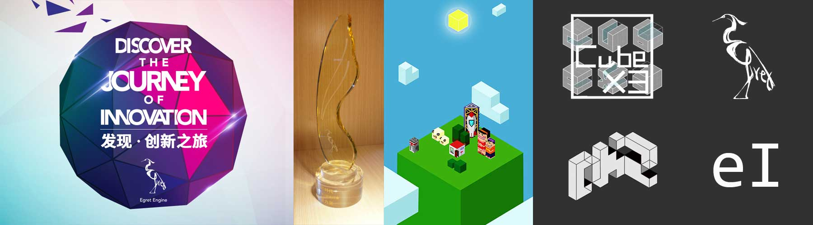

#INDIE GAME CUBEX3

**有关独立游戏CUBEX3的一切**

by DKZ 2015/8/11 update 2015/12/22

##CUBEX3

起初神创造天地

地是空虚混沌 渊面黑暗

神说 要有光

有了光再制作这个世界的

一草一木 动物和人

吃人的怪物和温暖的家

再放入云与风 

让日升日落 时空流转

这个世界就活了

##造物快感

我觉得制作独立游戏是一件有快感的事儿，同时也很容易让人膨胀。构思设计实现一手包办，在这个过程中控制欲和成就感会得到极大的满足。扮演游戏世界的造物主，获得专注沉浸其中。这个过程本身就是一种奖励。

CUBEX3本身也是有关于造物的。玩家扮演着游戏世界的造物主，我希望玩家通过建造这个6x6的方块，获得满足与成就感，体验“造物快感”。

##独立·自我表达

独立是独立游戏的全部，独立赋予游戏自由，不用听任何人的意见，不必考虑任何外部的限制。独立游戏会继承创造者的意志，优点也好缺点也好将自己与其他游戏区别开来。

整个过程都是在自我表达，在表达自我的同时很难或者不会听取其他人的意见。所以即使最后你把游戏做出来了，你也很难保证它能够得到认可，但我相信安迪沃霍尔的每个人都能成名15分钟。

##哲学

游戏和现实世界存在着联系，但要更为所欲为一点。物理定律，自然法则，随机性和递归循环。游戏在很多方面参照着自然世界，但又不完全相同。所以我们能从游戏中获得新的体验，于是游戏就有了意义。

CUBEX3的哲学即是吃与被吃的进化哲学，构建游戏世界的进化链和食物链。从基本的cube到草，在这里出现进化的岔路，幸运的草会长成树木，其他的会变成羊的食物。树木会形成森林养育人类，人类组成家庭，然后遵循人类社会的发展形成聚落、城市到后来发明火箭离开这个星球————发送游戏角色给其他玩家。另一条路羊喂了狼，狼变异成狗到变成各种怪物，世界向着不好的方向发展最后出现分解者吃掉一切————世界末日。

在宇宙层面上遵循黑暗森林法则，CubeX3账号密码坐标是同一个东西。但你要想和其他人取得联系不得不暴露自己的坐标，我的建议是不要回答。

##艺术

游戏是一门艺术，里面有美术设计、文学叙事、音乐、交互、运营等诸多方面。我相信这是有意义的。

##THX

这个游戏获得了2015白鹭杯HTML5游戏开发者大赛最佳创意奖提名和最具潜力奖。

先在此感谢下为cubex3配音的雅咩，帮我剪辑视频的徐瑞，白鹭的雪冰姐和其他相关的工作人员，这个游戏因为有你们的帮助而变得完整。

感谢我的家人和朋友给我提供的帮助和鼓励，你们是我坚实的大地。

感谢喜欢这个游戏的玩家，谢谢你们的认可，赋予CUBEX3意义，重新定义它，并给我继续前进的力量。

