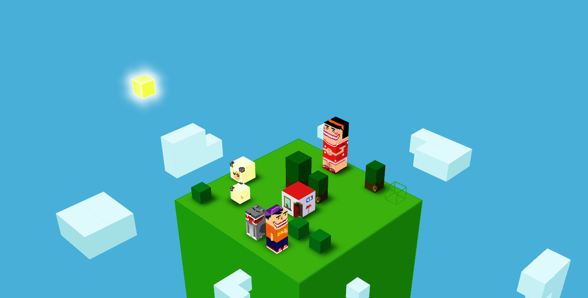

#INDIE GAME CUBEX3

**有关独立游戏CUBEX3的一切**

by DKZ 2015/8/11

这是一个很特殊的独立游戏作品，也是我的第一个独立游戏。

##CUBEX3

大学最后一个假期在找工作多次碰壁后决定做点东西。写框架建模设计最后用代码一点点磊起来，制作这个世界中的一草一木动物和人，吃人的怪物和温暖的家，再放入云与风，太阳与光，最后让时空流转这个世界就活过来了。

##造物快感

做独立游戏很容易让人膨胀，构思设计实现一手包办。在这个过程中控制欲和成就感会得到极大的满足，扮演游戏世界的造物主，获得专注沉浸其中。这个过程本身就是一种奖励，只是有时我对此并不满足，贪恋名利，又无法忍受孤独。

##独立

独立是独立游戏的全部，独立赋予游戏自由，不用听任何人的意见，不必考虑任何外部的限制。独立游戏会继承创造者的意志，优点也好缺点也好将自己与其他游戏区别开来。平心而论CUBEX3用的是不入流的技术走的是歪门邪道。但没关系这个项目不会停止。

##游戏

游戏是一门艺术，里面有绘画音乐叙事交互。我相信这是有意义的。我相信安迪沃霍尔的成名十五分钟。

写在这儿提醒自己勿忘初心。

