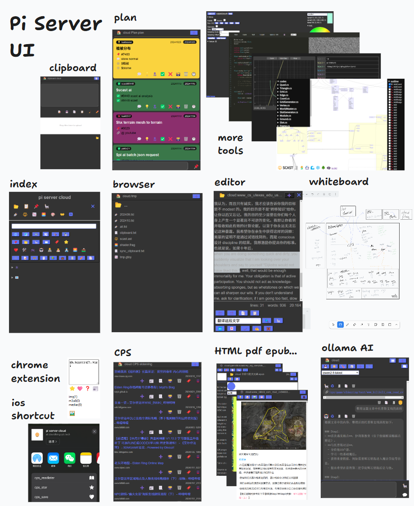

# 共生

**现AI时代的知识管理和效率工具集的形态**

2024/11/17 by DKZ

一直想介绍一下我个人的知识管理和效率工具集 pi server，但一直找不到合适的角度，因为从架构的角度讲这是一个烂项目。

我做这个项目已经有十年了，最开始它只是一个运行在树莓派上的网页，用来告诉我树莓派的ip，运行一些脚本之类。它甚至包含我刚开始学习编程时的代码。真的成为一个项目组织起来大概是2016年的时候，当时我在找工作，朋友在招聘公司帮我推简历被半路截胡进了朋友所在的那家招聘公司。主要做的事是一个chrome插件，帮助HR和猎头保存网上简历到公司的数据库。做了没多久朋友离职了，我也离开了那家公司，那个chrome插件被我改成一个保存网页的工具，连同之前写的一些爬虫整合成现在piserver的雏形。多年间这个工具积累了大量的历史数据，本着能用就行保持简单的原则，只是加一些文件管理和文档浏览修改之类的页面，工具也只是剪贴板同步一类的小工具。随着时间的推移这个项目越来越大，数据，笔记，NAS，Git，爬虫，后台监控，脚本运行，任务，日志，计划，备份，智能硬件反正有什么就往里面塞什么。中间也有几次小的重构，但由于历史数据太多包袱重，一直没有在架构上大动，虽然集成很多东西，一堆数据来源，大量的历史数据，不过由于一直保持简单的原则，加上除了核心模块其他工具之间的耦合也不多，一直感觉够用。  

这个项目开始爆炸是在2023年chatGPT火了之后，我开始往里面集成多个AI后台，RAG，Agent。几乎所有的工具都要集成AI，所有的数据都要和AI互动，感觉还是需要一些架构不然蛮搞下去楼要塌。我尝试寻找一些关于知识管理，大数据，笔记组织，图书分类系统之类的架构。也尝试了一些比较流行的知识管理系统，什么双链，思维导图之类，感觉不适合。我的数据大部分是结构化的储存在树状的文件系统，有标签系统，也做了全局的检索，所有的资源都有id可以相互关联，需求是不希望手动的建立关联，另外我不希望AI成为唯一的交互入口。考察了一圈好像没有现成的方案可以解决我的问题，而且根据我的尝试AI现在的能力可能没有办法接管这个项目，无论是响应速度还是需要的资源，如果要以AI为中心构建这一切在现在这个阶段似乎不太现实。  

所以回到我的问题，当前AI知识管理和效率工具集的形态应该是什么样的？

### 首先应该回答我为什么要自己构建AI工具？  

在不正式场合我自我介绍时会说我是一个战士，盾牌手，不打仗的时候是个铁匠，主修技能是敲击键盘，辅助技能是制造工具（实际我是游戏开发，精确一点是做平台工具这一块）。我了解工具的意义，工具的意义在于提高效率以淘汰落后的生产力，AI技术的进步无疑是提升了生产力，这个我深有体会，AI技术的进步最先淘汰的不会是底层的工作，程序员就是第一批，因为这个东西就是被这帮人创造出来的，那肯定要先解决自己的问题，然后等这个东西成熟了才会波及到其他的各行各业，每一次技术革命既然是革命那就都会伴随着一些痛苦，会淘汰一部分落后的生产力。我2023年AI刚火起来就被降本增效了，我清楚拿锄头锤子干不过拿枪拿炮，人卷不过机器。  

但我并不惧怕机器，虽然有些人的忧虑是有道理，今天AI抢了我的饭碗，明天AI要统治世界了。但我觉得我们离那一天真的还远，我们还有很多很多的机会，我觉得也可以给AI一个机会，我觉得不管它是AI还是外星人人啥的，我们作为人类要展现我们这个物种是可以和其他物种共生的是吧。如果我们作为人类都不能展现人性中积极的利他一面的话，我们制造的东西更不会有人性，而且人类统治这颗星球这么多年不靠我们打败了猛犸象，狮子老虎，我们只是幸存下来了，只是活下来了而已。说实话我并不认为机器威胁到人类生存，我们甚至不在一个生态位上，我们需要的水空气食物AI并不会和我们抢这些。我觉得应该合作，因为在AI干掉人类之前很有可能不和AI合作的人被和AI的合作人先干掉了。  

### 接下来的问题是这个AI工具是什么样的？

我觉得不应该把AI当作一个机器嵌入到一个架构中，如果把它限定死在某个结构中它就没有办法发挥它应有的作用。我们应该把它当作在这个架构中穿行的生物而不是用来架构的材料，给它更大的空间成长，结合更多的工具，链接触达更多的数据，它的角色应该是管家而不是房子本身，也许暂时它还不能胜任，它可能是个孩子，有些人可能不喜欢这种类人的说法，但你把它当一个牲口用也可以，总之把它想象成是活的。同时这个架构本身也不应该是定死的，我的目的并不是用AI去给这些数据赋予某种结构，而是让AI发现这些数据内在的结构。所以也许尽可能的保持自然的形态，保持简单才能给AI最大的发挥空间。何况我不知道这个结构是什么，我甚至不知道问题是什么，有时候问AI的时候我甚至不知道说什么？  

那么该怎么办？  

### 最终该如何构建现AI时代的知识管理和效率工具集形态？  

够建AI工具本身的过程也是学习的过程。我们的智慧到底从何而来？我觉的大语言模型可以证明语言、学习、分类、统计在其中扮演了相当重要的角色。每次AI取得突破性的成就都意味着我们对人类自身智慧的理解加深了一些。我们可以将这些理解运用在自身的学习过程中，AI探索解决问题的过程可能对我们解决正在面临的问题带来新的启发。  

我的答案是构建一个共生的形态，构建一个能够让AI和我们一起解决问题的空间，一个能够不断成长不断迭代的项目，不断的给它加东西，不断的给它新的任务，观察反馈然后在将这些反馈用于自生的进化。可能就像pi server这个项目一样，混乱才是它的常态，我们从混沌中建立秩序。尽管我不知道最终的形态是什么，我不知道AI到底怎么工作，我也不知道自己的的智慧从何而来，我只要确保我在求知的道路上了就行了，在这条路上借助AI的帮助，构建合适的工具一定会让我们爬的更高走的更远。  

借助AI我们可能穿过各种象征符号探究我们无法接触的想象世界。这个过程肯定伴随了痛苦，但想象一下我们有机会破解痛苦的作用机制，甚至解决人类的终极问题，天将降大任于斯人也，我想这个痛苦是可以承受的。活着固然重要可是我更好奇为什么而活，何况我们和AI并没有到你死我活的程度，我们离那一天还远，我们还有很多机会，抓住它，也给AI一个机会。

别担心，朋友们。