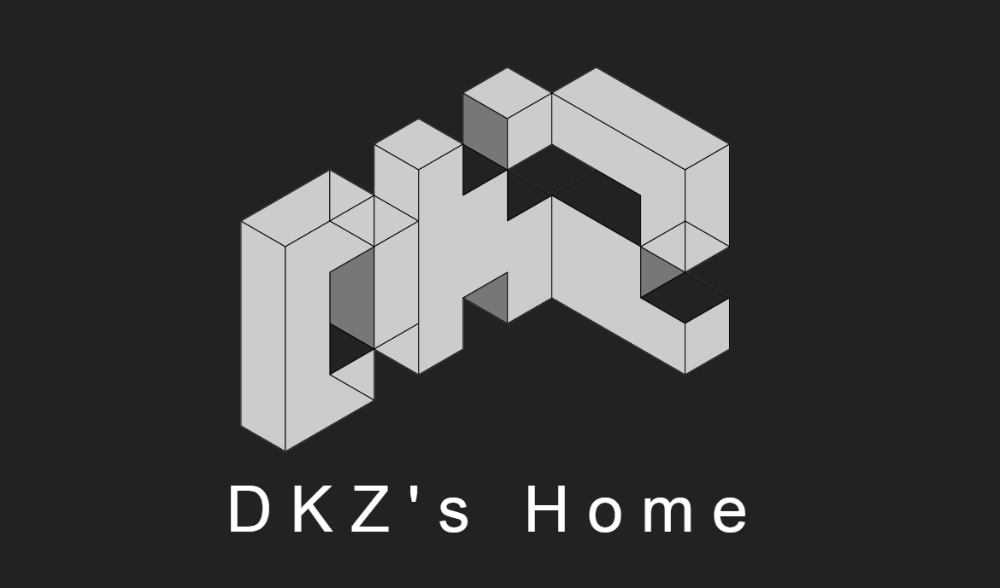

#DKZ's HOME

**改版我的主页**

by DKZ 2015/8/30 update 2015/9/22

在27日上线了新版的个人主页。

特别热衷于做这件事，展示分享或者说是炫耀吧(没错就是这么自恋！我最帅！

说真的做这件事的意义真不大，更多是为了自己开心从单调的工作中跳出来。至于多少人能看到？是否真的可以改变世界？我会不会红？真的说不准

雅咩有看到之前做的cubex3，表示很感兴趣！好开心！看来这个主页也算是有那么点用哈哈。这两天自己放了个假，什么都没做，买了个树莓派犒劳下自己。下个项目就从cubex3的手机版开始吧。

##介绍一下改版内容

* 从sae转移到了github page上，除了发布更新方便之外也希望新的平台有更多人关注吧。

* 用了新的主题“阴·阳”全是黑白灰，真的做的东西越来越素了，是长期没有性生活变得性冷淡了吧。

* 使用了自己的全屏滚动代替之前使用的fullpage

* 在之前的基础上重新排了内容。把之前比较混乱的作品和经历部分整合到了一个页面中。使用timeline切换展示，精简内容，更有条理，易于扩展。

* 使用canvas重构了技能树部分，为此写了个工具canvasTrigger，重置了自己的技能点，也是给未来的学习提供一个方向吧。

* contact页用了cubex3中的css-transform+css-spirit和之前设想的使用webgl不太一样，这块慢慢学吧。

* 主页也偷懒用了blog的开头，效果还不错。之后可能会用我的头像代替吧，我这么帅。

* update 2015/9/22 新的自动发布脚本autoBlog.py使用python markdown解析markdown生成博客html页面

最后欢迎大家访问[DKZ's HOME](http://davidkingzyb.github.io)
